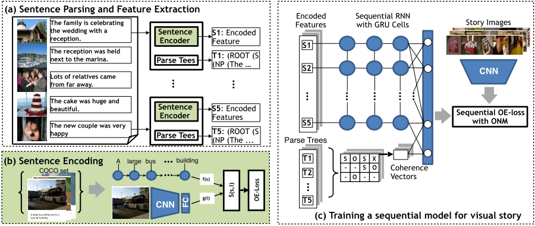

# Coherent Neural Story Illustration (WORK IN PROGRESS)
Story Illustration is the problem of retrieving/generating a sequence of images, given a natural language story as input. We propose a hierarchical [GRU](https://en.wikipedia.org/wiki/Gated_recurrent_unit) network that learns a representation for the input story and use it to retrieve an ordered set of images from a dataset. In its core, the model is designed to explicitly model coherence between sentences in a story optimized over sequential order embedding based loss function. This repository has the code to replicate experiments detailed in our paper titled "Show Me a Story: Towards Coherent Neural Story Illustration" ([PDF](http://openaccess.thecvf.com/content_cvpr_2018/papers/Ravi_Show_Me_a_CVPR_2018_paper.pdf)). The proposed network architecture is shown in the [Figure](./net_arch.png) below. 




## Install Instructions

- For the model 

  1. Download dataset from http://visionandlanguage.net/VIST/dataset.html
  2. Put sis (text) , dii (text) and images folder inside [./data/raw](./data/raw)
  3. Download glove_6B_300 dim vectors from https://nlp.stanford.edu/projects/glove/ and put it in [./data/](./data/) folder
  4. pip install -r requirements.txt

- For the coherence vector (Works only in Linux. Let us know if you make it work in Windows)

  1. Download stanford codeNLP parser (3.9.2) from https://stanfordnlp.github.io/CoreNLP/ to [root dir](./).
    
     - `unzip stanford-corenlp-full-2018-10-05.zip`
     - `mv stanford-corenlp-full-2018-10-05.zip stanford-parser`

  2. Download WordNet-3.0.tar.gz from https://wordnet.princeton.edu/download/current-version to [root dir](.).
     - `unzip WordNet-3.0.tar.gz`
     - Follow instructions in INSTALL file in the [folder](./WordNet-3.0/). 
     
  3. Download and Install Brown Coherence Model (https://bitbucket.org/melsner/browncoherence/src/default/) to [root dir](.)
    
     - `wget https://bitbucket.org/melsner/browncoherence/get/d46d5cd3fc57.zip -O browncoherence.zip`
     - `unzip browncoherence.zip`
     - `mv melsner-browncoherence-d46d5cd3fc57 browncoherence`
     - `cd browncoherence`
     - `mkdir lib64`
     - `mkdir bin64`
     - `vim include/common.h` and modify DATA_PATH definition to point to "./data/"
     - `uncompress data/ldaFiles.tar.bz2 and models/ww-wsj.dump.bz2
     - `vim Makefile`
     
       Change the followings from top to bottom.
       ```
       WORDNET = 1
       WORDNET = 0
       ```
       ```
       CFLAGS = $(WARNINGS) -Iinclude $(WNINCLUDE) $(TAO_PETSC_INCLUDE) $(GSLINCLUDE)
       CFLAGS = $(WARNINGS) -Iinclude $(WNINCLUDE) $(TAO_PETSC_INCLUDE) $(GSLINCLUDE) -fpermissive 
       ```
       ```
       WNLIBS = -L$(WNDIR)/lib -lWN
       WNLIBS = -L$(WNDIR)/lib -lwordnet
       ```
       Modify `WNDIR` to point to Wordnet installation
     - `make everything`

## Data Processing
1. run process_vist.py 
2. run vggfeat_vist.py
3. run get_cohvec_vist.py

## To use trained model on evaluation for VIST test data
1. run '' for eval baseline 
2. run '' for eval nsi 
3. run '' for eval cnsi

## To train your own models
1. Modify config_all.py to modify parameters. 
2. To train stage 1 run ''
3. To train baseline run ''
4. To train stage2 nsi run ''
5. To train stage2 cnsi run '' 

## To evaluate on different data
1. Create test data storied in same format as in data/test/
2. Put test images as part of images 
3. Extract vggfeat for these images by modifying vggfeat_vist.py code
4. Run Step 2 or Step as needed

## Reference
If you use this code or any part of it, please cite the following paper. 
```
@InProceedings{Ravi_2018_CVPR,
author = {Ravi, Hareesh and Wang, Lezi and Muniz, Carlos and Sigal, Leonid and Metaxas, Dimitris and Kapadia, Mubbasir},
title = {Show Me a Story: Towards Coherent Neural Story Illustration},
booktitle = {The IEEE Conference on Computer Vision and Pattern Recognition (CVPR)},
month = {June},
year = {2018}
}
```
